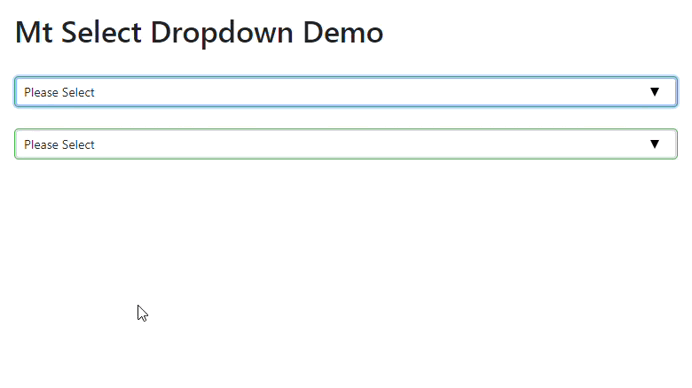

# mt-select-dropdown

  **mt-select-dropdown is a versatile and customizable Angular component that provides a dropdown interface for selecting single or multiple options.**


## mt-select-dropdown Key Features:

* **Multi-select and Single-select:** Choose between standard dropdown behavior or picking multiple values.
* **Custom Templates:** Utilize custom templates to tailor the appearance of selected options and dropdown items.
* **Lazy Loading:** Improve performance by loading options on demand, especially for large datasets.
* **Search:** Efficiently find options by filtering with a built-in search function.
* **Flexibility:** Fine-tune styling and behaviors with a range of input properties and events.
* **Accessibility:** Ensure inclusive use with appropriate ARIA attributes and keyboard navigation support.

## Installation

```sh
$ npm install mt-select-dropdown

```

## Dependencies

**mt-select-dropdown** requires Bootstrap 5 or above to function properly. It is listed as a peer dependency, so you'll need to install it separately along with `mt-select-dropdown`:

```bash
npm install bootstrap 
```

## Import and Usage:

```tsx
import { Component } from '@angular/core';
import { MtSelectDropdownComponent } from 'mt-select-dropdown';

@Component({
  selector: 'app-root',
  standalone: true,
  imports: [MtSelectDropdownComponent],
  templateUrl: './app.component.html',
  styleUrl: './app.component.scss'
})
export class AppComponent {
  title = 'MtSelectDropdown-app';

  selectedOption = [
    { id: 1, name: 'India' },
    { id: 2, name: 'USA' },
    { id: 3, name: 'JAP' },
    { id: 4, name: 'PUK' },
    { id: 5, name: 'RAT' },
    { id: 6, name: 'PAT' },
  ]
}

```


## Options

The Mt-Select-Dropdown component provides various configuration options to customize its behavior:

| Option Name          | Type    | Default Value       | Description                                                                                   |
|----------------------|---------|---------------------|-----------------------------------------------------------------------------------------------|
| options              | any[]   | []                  | Array of options to be displayed in the dropdown.                                             |
| compareKey           | string  | 'id'                | The key to use when comparing options for selection.                                           |
| labelKey             | string  | 'name'              | The key to use for displaying the label of each option.                                        |
| batchLimit           | number  | -                   | The maximum number of selected options to display in multi-select mode bwfore.                        |
| selectedItemTemplet  | TemplateRef<any> | -  | Custom template for rendering selected items.                             |
| listTemplet          | TemplateRef<any> | -  | Custom template for rendering items in the dropdown list.                                       |
| willAutoClose        | boolean | true                | Flag indicating whether the dropdown should automatically close when clicking outside.         |
| isMultiSelect        | boolean | false               | Flag to enable multi-select mode.                                                             |
| placeholder          | string  | 'Please Select'    | Placeholder text to display when no option is selected.                                         |
| sCO                  | StyleClassOptions | {} | Style class options to customize the appearance of the dropdown and its items.                   |
| attachToBody         | boolean | false               | Flag to indicate whether the dropdown should be attached to the body.                           |
| lazyLoading          | boolean | false               | Flag to enable lazy loading of options if apiPath provided then it will handle the api also.                                                        |
| addNotFound          | boolean | false               | Flag to add a "Not Found" option when searching.                                               
| apiPath              | string  | '' | The API path for lazy loading options.                                                         |
| limit                | number  | 10                  | The maximum number of options to fetch from the API at once.                                    |
| page                 | number  | 1                   | The page number to fetch options from when using lazy loading.                                  |
| order_by             | string  | 'name'              | The field to use for sorting options when fetching from the API.                                |
| order_direction      | string  | 'asc'               | The direction of sorting options when fetching from the API ('asc' or 'desc').                   |
| searchText           | string  | ''                  | The search query to filter options when using lazy loading.                                     |
| parentIdValue        | any     | null                | The key of the parent ID used in API requests for lazy loading like is im loding cities and i want that to be filter by state then parentIdValue may be state_id.                               |
| parentId             | any     | null                | The parent ID used in API requests for lazy loading e.g if i want cities of Ladakh then give Ladakh id in my DB.                                            |
| selectedIds          | any     | null                | The selected IDs used in API requests for lazy loading this will be given by component so that you can write a logic of sorting the selected on top.                                         |
| selectedIdKey        | string  | 'id'                | The key to use for selected IDs in API requests for lazy loading.                               |
| otherParentId        | any     | null                | Another parent ID used in API requests for lazy loading.                                        |
| otherParentIdValue   | any     | null                | The value of the other parent ID used in API requests for lazy loading.                          |


## Demo



## Basic Usage Example

```html
<mt-select-dropdown
  [options]="options"
  [formControlName]="myControl"
  [onSelect]="onSelectMyControl">
</mt-select-dropdown>
```


## Usage of Custom Templet

```html
   <div class="row">
      <div class="col-md-12">
          <label class="form-label"> Partcipant<span class="text-danger">*</span></label>
          <div class="input-group mb-3">
              <div type="text" class="form-control form-control-sm">
                  <mt-select-dropdown [attachToBody]="true" [listTemplet]="partcipantListItem" [selectedItemTemplet]="partcipantSelectedItem" formControlName="partcipant" [isMultiSelect]="true"
                      [batchLimit]="2" [options]="options" class=""></mt-select-dropdown>
              </div>
              <span class="input-group-text"><i class="fa fa-plus"></i></span>
          </div>
          <ng-template #partcipantListItem let-option="option">
              <div class="row">
                  <div class="col-md-12">
                      <label class="form-label">{{option.name}}</label>
                  </div>
                  <div class="col-md-6">
                      <label class="form-label">{{option.email}}</label>
                  </div>
                  <div class="col-md-6">
                      <label class="form-label">{{option.phone}}</label>
                  </div>
              </div>
          </ng-template>

          <ng-template #partcipantSelectedItem let-option="option">
              <div class="row">
                  <div class="col-md-12">
                      <label class="form-label">{{option.name}}({{option.email}})</label>
                  </div>
              </div>
          </ng-template>
      </div>
  </div>
```

## Usage Example of LazyLoding with Without Api

```html
    <mt-select-dropdown
      [options]="options"
      [lazyLoading]="true"
      (onSearch)="loadOptions($event)"
      (loadNext)="loadMoreOptions()">
    </mt-select-dropdown>
```

## Usage Example of LazyLoding with Api
```html
<div class="col-md-6 mb-4">
    <label class="form-label">State<span class="text-danger">*</span></label>
    <mt-select-dropdown class="w-100" [order_by]="'id'" [lazyLoading]="true" [attachToBody]="true"
        formControlName="stateId" [apiPath]="url+'/state_dropdown'" class=""></mt-select-dropdown>
</div>
```

### Configuration for LazyLoding with Api

```tsx
  import {
    HttpClient,
  } from '@angular/common/http';
  import { MtSelectDropdownService } from 'mt-select-dropdown';

  @Injectable({
    providedIn: 'root',
  })
  export class HttpService {
    constructor(private http: HttpClient, private dropdownService: MtSelectDropdownService) {
      dropdownService.setHttpClient(http);//need to pass http client this will be used by component for http request
    }
  }
```
In Component we do this 

```tsx
import { HttpErrorResponse } from '@angular/common/http';
import { Injectable } from '@angular/core';
import { catchError, throwError } from 'rxjs';

@Injectable({
  providedIn: 'root'
})
export class MtSelectDropdownService {

  http: any;

  constructor() { }

  setHttpClient(http: any) {
    this.http = http
  }
}
```

We call the Api Like this 

```tsx
myService = inject(MtSelectDropdownService);

callApi(isMarge: boolean = false, searchText: string = '') {
    return new Promise((resolve, reject) => {
      try {
        this.loadingOptions = true;
        const lazyLoadingOptions = {
          limit: this.limit,
          page: this.page,
          order_by: this.order_by,
          order_direction: this.order_direction,
          searchText: this.searchText,
          parentIdValue: this.parentIdValue,
          parentId: this.parentId,
          selectedIds: this.selectedIds == null || this.selectedIds == undefined ? null : this.selectedIds,
          selectedIdKey: this.selectedIdKey,
          otherParentId: this.otherParentId,
          otherParentIdValue: this.otherParentIdValue,
          q: searchText
        }
        this.myService.post(this.apiPath, { ...lazyLoadingOptions })
          .subscribe({
            next: (list: any) => {
              if (list?.status == 1) {
                if (!list?.nextPage) this.isMorepage = false;
                this.page += 1;
                if (isMarge) {
                  this.options = [...this.options, ...list?.data];
                  for (let index = 0; index < list.data.length; index++) {
                    const element = list.data[index];
                    this.filteredOptions.push(element)
                  }
                }
                else { this.options = list?.data; this.filteredOptions = this.options; }
                this.loadingOptions = false;
                if (!this.filteredOptions.length && searchText) {
                  this.addNotFoundToList(searchText)
                }
                resolve(list)
              }
            },
            error: (e: any) => {
              this.loadingOptions = false;
              reject(e)
            },
          });
      } catch (e) {
        reject(e)
      }
    })
  }

```

### Events

The Mt-Select-Dropdown library emits several events to communicate changes and interactions with the parent component:

| Event Name | Type                    | Description                                                |
|------------|-------------------------|------------------------------------------------------------|
| onSelect   | EventEmitter<any \| any[]> | Emit the selected value(s) when an option is selected.   |
| onOpen     | EventEmitter<void>         | Emit when the dropdown is opened.                        |
| onClose    | EventEmitter<void>         | Emit when the dropdown is closed.                        |
| onSearch   | EventEmitter<string>       | Emit the search query when the user performs a search.   |
| loadNext   | EventEmitter<void>         | Emit to load the next batch of options in lazy loading mode. |


### Methods

The Mt-Select-Dropdown component provides several methods to interact with the dropdown programmatically:

| Method Signature                                  | Description                                      |
|---------------------------------------------------|--------------------------------------------------|
| writeValue(value: any | any[]): void            | Write select option to form control.             |
| registerOnChange(fn: any): void                   | Register change callback.                        |
| registerOnTouched(fn: any): void                  | Register touched callback.                       |
| setDisabledState(isDisabled: boolean): void       | Set the disabled state of the control.           |

## StyleClassOptions

The `StyleClassOptions` interface defines the available CSS classes that can be applied to customize the appearance of the dropdown and its elements.

| Property             | Description                                           | Default Value   |
|----------------------|-------------------------------------------------------|-----------------|
| dropdown_container   | CSS class for styling the dropdown container          | N/A             |
| dropdown_form_control| CSS class for styling the custom input div            | N/A             |
| selectedContainer    | CSS class for styling the selected options container in multi-select mode | N/A |
| selectedItem         | CSS class for styling the selected option item in multi-select mode       | N/A |
| unselectItem         | CSS class for styling the unselect item (cross) in multi-select mode       | N/A |
| placeholder          | CSS class for styling the placeholder text            | N/A             |
| dropSymbol           | CSS class for styling the drop symbol                 | N/A             |
| dropdownMenu         | CSS class for styling the dropdown menu               | N/A             |
| searchInput          | CSS class for styling the search input in the dropdown| N/A             |
| dropdownItem         | CSS class for styling the dropdown items in the list  | N/A             |


```html
<mt-select-dropdown
  [options]="options"
  [sCO]="styleClassOptions"
  [formControlName]="myControl"
  [onSelect]="onSelectMyControl">
</mt-select-dropdown>
```
## Authors

* **Mohd Taqi Arzoo** - *Initial work* - [Mohd Taqi](https://taqiarzoo.weebly.com/)

## License

[MIT License](https://andreasonny.mit-license.org/2019) © Mohd Taqi Arzoo
